<h1 id="summary">Summary</h1>

* [OAuth Authentication wih Express and Passport](#oauth)
  * [Intro to Authentication](#intro)
  * [Authentication vs. Authorization](#authentication-authorization)
  * [Why OAuth?](#why)
  * [What is OAuth?](#what)
    * [Vocab](#vocab)
  * [How Does OAuth Work?](#how)
* [The App's User Stories](#stories)
* [2) Passport JS - Framework](#passport)
  * [passport-google-oauth](#passport-google)
* [1) Session Middleware](#session)
  * [Verifying Session Middleware](#verifying-session)
* [3) Install Passport](#install-passport)
  * [Create a Passport Config Module](#passport-config-file)
* [4) Install OAuth Strategy](#install-passport-oauth)
* [5) Define Routes for Authentication](#routes)
* [6) Authorization](#authorization)
* [7) View/Students/Index.ejs](#view)
* [Create Google OAuth](#google-oauth)
* [Example - Google OAuth](#example)
  * [Installation](#installation)
  * [.env](#env)
  * [server.js](#server)
  * [config/database.js](#config-database)
  * [config/passport.js](#config-passport)
  * [controllers/students.js](#controllers)
  * [models/student.js](#models)
  * [routes/index.js](#routes-index)
  * [routes/students.js](#routes-students)
  * [views/students/index.ejs](#views-students-index)

<h1 id="oauth">OAuth Authentication wih Express and Passport</h1>

<h2 id="intro">Intro to Authentication</h2>

[Go Back to Summary](#summary)

<h3 id="authentication-authorization">Authentication vs. Authorization</h3>

[Go Back to Summary](#summary)

* Authentication and Authorization are not the same thing.
   * **Authentication** verifies a user's identity
   * **Authorization** determines what functionality a given user can accss

<h2 id="why">Why OAuth?</h2>

[Go Back to Summary](#summary)

* Consider applications where we have to sign up and log in using a username and a password...
* What are the pitfalls of username/password authentication from a user's perspective?
   * Creating multiple logins requires you to remember and manage all of those login credentials.
   * You will often use the same credentials across multiple sites, so if there's a security breach at one of the sites where you are a member, the hackers know that users often use the same credentials across all of their sites - oh snap!
   * You are tempted to use simple/weak passwords so that you can remember all of them.

* What would be the pitfalls from a business or developer's perspective?
   * Managing users' credentials requires carefully crafted security code written by highly-paid devs.
   * Users (customers) are annoyed by having to create dedicated accounts, especially for entertainment or personal interest type websites.
   * Managing credentials makes your business a target for hackers (internal and external) and that brings with it liability.

* The bottom-line is that the majority of users prefer to use OAuth instead of creating another set of credentials to use your site.
* When users are your customers, you want to make them as happy as possible!

<h2 id="what">What is OAuth?</h2>

[Go Back to Summary](#summary)

* OAuth is an open standard that provides **client applications** access to **resources** of a service such as Google with the permission of the resources' **owner**.
* There are numerous [OAuth Providers](https://en.wikipedia.org/wiki/List_of_OAuth_providers)

<h3 id="vocab">Vocab</h3>

[Go Back to Summary](#summary)

* **OAuth provider**: A service company such as Google that makes its OAuth authentication service available to third-party applications.
* **client application**: Our web application! Remember, this is from an OAuth provider's perspective.
* **owner**: A user of a service such as Facebook, Google, Dropbox, etc.
* **resources**: An owner's information on a service that may be exposed to client applications. For example, a user of Dropbox may allow access to their files.
* **access token**: An temporary key that provides access to an owner's resources.
* **scope**: Determines what resources and rights (read-only, update, etc) a particular token has.

<h2 id="how">How Does OAuth Work?</h2>

[Go Back to Summary](#summary)


* The ultimate goal is for the client application (our web app) to obtain an **access token** from an OAuth provider that allows the app to access the user's resources from that provider's API's.
* Usually we only want to access to the most basic of resources the user could grant us - their **name**, **email** & maybe their **avatar**.
* However, it's possible to request access to resources such as a user's Facebook friends, tweets, Dropbox data, etc.
* OAuth is **token** based.
* A token is a generated string of characters.
* Once a user okays our web app's access, our web app receives a code parameter that is then exchanged for an **access token**.
* Each token has a scope that determines what resources an app can access for that user.

<h1 id="stories">The App's User Stories</h1>

[Go Back to Summary](#summary)

* The following stories are COMPLETE in the starter code:
   * As a Visitor:
      * I want to view fun facts about past and present SEI Students so that I can know more about them.
      * I want to be able to search for students by their name so that I don't have to scroll through a long list.
      * I want to sort the list of students by cohort or name so that I can more easily find the student I'm looking for.

* We will complete these stories today:
   * As an Authenticated Student:
      * I want to add fun facts about myself so that I can amuse others.
      * I want to be able to delete a fact about myself, in case I embarrass myself.
      * I want to view the Google avatar instead of the placeholder icon.

<h1 id="passport">2) Passport JS - Framework</h1>

[Go Back to Summary](#summary)

   ```bash
      npm i passport
   ```

* Implementing OAuth is complex. There are redirects going everywhere, access tokens that only last for a short time, refresh tokens used to obtain a fresh access toeken, etc.
* **Passport is by far the most popular authentication framework out there for Expesss apps.**
* [Passport's website](http://www.passportjs.org/) states that it provides Simple, unobtrusive authentication for Node.js. Baiscally this means that it handles of the mundane tasks related to authentication for us, but leaves the details up to us.
* Passport uses **Strategies** designed to handle a given type of authentication. Think of them as plug-ins for Passport.
* Each Express app with Passport can use one or more of these strategies.

<h2 id="passport-google"><a href="http://www.passportjs.org/packages/passport-google-oauth/">passport-google-oauth</a></h2>

[Go Back to Summary](#summary)

* Passport strategies for authenticating with Google using OAuth 1.0a and OAuth 2.0.
* This is a meta-module that combines passport-google-oauth1 and passport-google-oauth20. It exists for backwards-compatibility with applications making use of the combined package. As of version 1.0.0, it is encouraged to declare dependencies on the module that implements the specific version of OAuth needed.
* [passport-google-oauth](https://github.com/jaredhanson/passport-google-oauth) strategy.

   ```bash
      npm i passport-google-oauth
   ```

* **Passport is just a middleware designed to authenticate requests.**
* When a request is sent from an authenticated user, Passport's middleware add a `user` object to the `req` object.
* You will then be abble to access that `req.user` object in all of our controller actions.

<h1 id="session">1) Session Middleware</h1>

[Go Back to Summary](#summary)

* Before we install Passport a strategy, we need to install the [express-session](https://github.com/expressjs/session?_ga=1.40272994.1784656250.1446759094) middleware.

   ```bash
      npm i express-session
   ```

* Sessions, are a **sever-side** way of remembering a user's browser session.
* It remembers the browser session by setting a cookie that contains a session id.  **No other data is stores in the cookie, just the id of the session**.
* On the server-side, the application can store data pertaining to the session.
* Passport will use the session, which is an in-memory data-store by default, to stroe a nugget of information that will allow us to lookup that user in the database.

* Install `express-session`
* In `server.js` :
  * **Require** it below the `require('cookie-parser')` `(logger)`:

   ```JavaScript
      const cookieParser = require('cookie-parser');
      const session = require('express-session');              //! Require session package below cookie-parser
   ```

   * Don't forget to require `dotenv` package and `database` package beofre `var app = express()`.

   ```JavaScript
      require('dotenv').config();                             //! Require Dotenv
      require('./config/database');                           //! Require MongoDB Database
   ```

   * **Configure and mount** the session middleware below the `app.use(cookieParser())` middleware.

   ```JavaScript
      app.use(cookieParser());
      app.use(session({                                        //! Session middleware, mount AFTER cookieParser();
         secret: 'SEIRocks!',
         resave: false,
         saveUninitialized: true
      }));
   ```

   * The `secret` is used to digitally sign the session cookie making it very secure. You can change it to anything you want. Don't worry about the other two settings, they are only being set to suppress deprecation warnings.
  
   * We can put our `secret` into our `.env` file

   ```bash
      SESSION_SECRET=my$up3r$3cr3t
   ```

   ```JavaScript
      app.use(cookieParser());
      app.use(session({                                        //! Session middleware, mount AFTER cookieParser();
         secret: process.env.SESSION_SECRET,
         resave: false,
         saveUninitialized: true
      }));
   ```  

<h2 id="verifying-session">Verifying Session Middleware</h2>

[Go Back to Summary](#summary)

* Open the Resources tab in DevTools, then expand Cookies in the menu on the left.
* A cookie named connect.sid confirms that the session middleware is doing its job.

<h1 id="install-passport">3) Install Passport</h1>

[Go Back to Summary](#summary)

* The Passport middleware is easy to install, but challenging to set up correctly.

   ```bash
      npm i passport
   ```

* **Require** `passport` below `express-session`

   ```JavaScript
      const session = require('express-session');                 //! Require session package
      const passport = require('passport');                       //! Require passpor package -  AFTER session (alwyas)
   ```
* **Mount** passport

   * Whit Passport required, we need to mount it. Be sure to mount after the session and always before any of your routes are mounted that would need access to the current user:

   ```JavaScript
      app.use(session({                                     //! Session middleware, mount AFTER cookieParser();
         secret: process.env.SESSION_SECRET,
         resave: false,
         saveUninitialized: true
      }));
      app.use(passport.initialize());                       //! Passport middleware, mount AFTER session (always)
      app.use(passport.session());                          //! Passport middleware, mount AFTER session (always)

   ```

<h2 id="passport-config-file">Create a Passport Config Module</h2>

[Go Back to Summary](#summary)

* Because it takes a significant amout of code to configure Passport, we will create a separate module so that we don't pollute `server.js`.

   ```bash
      touch config/passport.js
   ```

* Our **`config/passport`** module is not middleware.
* Its code will basically configure Passport and be done with it. We'are not going to export anything either.

* In **`server.js`** require below our database

   ```bash
      require('./config/database');
      require('./config/passport');                           //! Require our passport file after database
   ```

* In **`config/passport.js`** module we will certainly access the `passport` module:

   ```JavaScript
      const passport = require('passport');                                         //! Require passport package
   ```

<h1 id="install-passport-oauth">4) Install OAuth Strategy</h1>

[Go Back to Summary](#summary)

* **Install** the google oauth strategy

   ```bash
      npm i passport-google-oauth
   ```

   * This module implements Google's OAuth 2.0 and 1.0 API.
   * Note that OAuth 1.0 does still exist here and there, but it's pretty much obsolete.

* In **`config/passport.js`**
  * **Require** the `passport-google-oauth` module below `passport` 

   ```JavaScript
         const passport = require('passport');                                         //! Require passport package
         const GoogleStrategy = require('passport-google-oauth').OAuth2Strategy;       //! Require google strategy after passport
   ```

     * Note that the variable is named using upper-camel-case.
   
   * To configure Passport we will:
     * **1)** Call the `passport.use` method to plug-in an instance of the OAuth strategy and provide a verify callback function that will be called whenever a user has logged in using OAuth.
     * **2)** Define a serializeUser method that Passport will call after the verify callback to let Passport know what data we want to store in the session to identify our user.
     * **3)** Define a serializeUser method that Passport will call on each request when a user is logged in. What we return will be assigned to the `req.user` object.
   
   * Now it's time to call the `passport.use` method to plug-in an instance of the OAuth strategy and provide a **verify callback function** that will be called whenever a user logs in with OAuth in `passport.js`.

   ```JavaScript
         const passport = require('passport');                                         //! Require passport package
         const GoogleStrategy = require('passport-google-oauth').OAuth2Strategy;       //! Require google strategy after passport
         
         passport.use(new GoogleStrategy(
            {
               clientID: process.env.GOOGLE_CLIENT_ID,
               clientSecret: process.env.GOOGLE_CLIENT_SECRET,
               callbackURL: process.env.GOOGLE_CALLBACK
            },
            function(accessToken, refreshToken, profile, cb) {
               // a user has logged in with OAuth...
            }
         ));
   ```
    * The callback well be called by Passport when a user has logged in with OAuth
    * It's called a **`verify callback`** because with most other strategies we would have to verify the credentials, but with OAuth, there are no credentials.
    * In this callback we must:
      * Fetch the user from the database and provide the back to Passport by calling the `cb` callback method, or...
      * If the user does not exist, we have a new user. We will add them to the database and pass along this new user in the `cb` callback method.
    * In user's `profile` - this object is the key. It will contain the user's Google Id.
    * In order to find a user in our database by their Google Id, we'are going to need to add a field to our `Student` model's schema to hold it.

* In **`models/student.js`**

   ```Javascript
      const mongoose = require('mongoose');
      const Schema = mongoose.Schema;

      const factSchema = new Schema(
         {
            text: String
         }, 
         {
            timestamps: true
         }
      );

      const studentSchema = new Schema({
         name: String,
         email: String,
         cohort: String,
         avatar: String,
         facts: [factSchema],
         googleId: String
      }, {
         timestamps: true
      });

      module.exports = mongoose.model('Student', studentSchema);
   ```

* In **`config/passport.js`**

  * **Require** the student model (schema):

  ```JavaScript
         const passport = require('passport');                                         //! Require passport package
         const GoogleStrategy = require('passport-google-oauth').OAuth2Strategy;       //! Require google strategy after passport
         const Student = require('../models/student');                                 //! Require database schema  
  ```

  * Add this code to our **callback** function:

   ```JavaScript
         passport.use(new GoogleStrategy(
            {
               clientID: process.env.GOOGLE_CLIENT_ID,
               clientSecret: process.env.GOOGLE_CLIENT_SECRET,
               callbackURL: process.env.GOOGLE_CALLBACK
            },
            function(accessToken, refreshToken, profile, cb) {
               Student.findOne({ 'googleId': profile.id }, function(err, student) {
                  if (err) return cb(err);
                  if (student) {
                     return cb(null, student);
                  } else {                               //+ we have a new student via OAuth!
                     let newStudent = new Student({
                        name: profile.displayName,
                        email: profile.emails[0].value,
                        googleId: profile.id
                     });
                     newStudent.save(function(err) {
                        if (err) return cb(err);
                        return cb(null, newStudent);
                     });
                  }
               });
            }
         ));
   ```

  * **de/serializeUser Methods**
    * First callback method we just created is called when a user logs in, then the `passport.serializerUser` is called in order to set up the session.
    * The `passport.deserializerUser` method is called everytime a request comes in from an existing looged in user - it is this method where we return what we want passport to assign to the `req.user` object.

   * The `passport.serializeUser` method that's used to give Passport the nugget of data to put into the session for this authenticated user.

   ```JavaScript
         passport.serializeUser(function(student, done) {            //+ Get the id
            done(null, student.id);
         });
   ```

      * Passport gives us a full user object when the user logs in, and we give it back the tidbit to stick in the session.
      * Again, this is done for server scalability and performance reasons - a lot of session data sucks.
  
  * The `passport.deserializeUser` method is used to provide Passport with the user from the db we want assigned to the `req.user` object.
   
   ```JavaScript
      passport.deserializeUser(function(id, done) {                  //+ Use the id to find a user in our database
         Student.findById(id, function(err, student) {
            done(err, student);
         });
      });
   ```
   
      * Passport gave us the `id` from the session and we use it to fetch the student to assign to `req.user`.

<h1 id="routes">5) Define Routes for Authentication</h1>

[Go Back to Summary](#summary)

* Our app will provide a link for the user to click to login with Google OAuth. This will require a route on our server to handle this request.
* Also, we need to define the route `/oauth2callback`. We told Google to call on our server after the user confirms or denies their OAuth login.
  
* In **`routes/index.js`**

  * **Require** `passport`

   ```JavaScript
         const express = require('express');
         const router = express.Router();
         const passport = require('passport');                          //! Require passport package

         router.get('/', function(req, res) {                           //! Render our only view
            res.redirect('/students');
         });
   ```

   * Google OAuth Login route

   ```JavaScript
         router.get('/auth/google', passport.authenticate(
            'google',
            { 
               scope: ['profile', 'email'] 
            }
         ));
   ```

      * The `passport.authenticate` function will take care of coordinating with Google's OAuth server.
      * The user will be presented the consent screen if they have now previously consented.
      * Then Google will call our Google callback route.
      * Note that we are specifying that we want passport to use the `google` strategy. Remember, we could have more than one strategy in use.
      * We are also specifying the scope that we want access to, in this case, `['profile', 'email']`

   * Google Callback Route
      * Below our login route, add the callback route that Google will call after the user confirms:
  
   ```JavaScript
         router.get('/oauth2callback', passport.authenticate(
            'google',
            {
               successRedirect : '/students',
               failureRedirect : '/students'
            }
         ));
   ```

      * Note that we can specify the redirects for a successful and unsuccessful login.

   * Google Logout Route

   ```JavaScript
         router.get('/logout', function(req, res){
            req.logout();
            res.redirect('/students');
         });
   ```

      * Note that the `logout()` method was automatically added to the request (`req`) object by Passport.

* In **`controllers/student.js`**
  * Require `Student` Schema

   ```JavaScript
      const Student = require('../models/student');         //! Require Models Schema

      module.exports = {

      };
   ```

  * Create the `index` action to pass in `req.user`:

   ```JavaScript
         function index(req, res, next) {
         console.log(req.query); //! requesting from the query(link) not from the body
         //+ Make the query object to use with Student.find based up
         //+ the user has submitted the search form or now
            let modelQuery = req.query.name ? {name: new RegExp(req.query.name, 'i')} : {};
         //+ Default to sorting by name
            let sortKey = req.query.sort || 'name';
            Student.find(modelQuery).sort(sortKey).exec(function(err, students) {
               if (err) return next(err);
               // Passing search values, name & sortKey, for use in the EJS
               res.render('students/index', { 
               students,
               user: req.user,
               name: req.query.name, 
               sortKey 
               });
            });
         };
   ```
      * Now the logged in student is in a `user` variable that's available inside of **students/index.ejs**. If nobody is logged in, `user` will be `undefined` (falsey).
  
   * Create the `addFact` action

   ```JavaScript
         function addFact(req, res, next) {
            req.user.facts.push(req.body);
            req.user.save(function(err) {
               res.redirect('/students');
            });
         }
   ```

      * Note that `req.user` is a Mongoose user document.

<h1 id="authorization">6) Authorization</h1>

[Go Back to Summary](#summary)

* Passport adds a nice method to request object, `req.isAuthenticated()` that returns `true` or `false` depending upon whether there's logged in user or not.
* We're going to write our own little middleware to take advantages of `req.isAuthenticated()` to perform some authorization.

* Authorization Middleware
  
  * Express's middleware and routing is extremely flexible and powerful.
  * We can actually **insert** additional middleware functions before a route's final middleware functions!

  * In **`routes/students.js`**, modiffy the post action
  
   * Add the basic information
  
   ```JavaScript
      const express = require('express');                            //! Require express package
      const router = express.Router();                               //! Shorthand to express.Router()
      const studentsCtrl = require('../controllers/students');       //! Require the controller

      router.get('/students', studentsCtrl.index);

      module.exports = router;
   ```

   * Create Post router
  
   ```JavaScript
         router.post('/facts', isLoggedIn, studentsCtrl.addFact);
   ```

      * Take note of the inserted `isLoggedIn` middleware function.
      * Our custom `isLoggedIn` middleware function, like all middleware, will either call `next()`, or `respond` to the request.
      * Put our new middleware at the very bottom
  
   ```JavaScript
         function isLoggedIn(req, res, next) {
            if (req.isAuthenticated()) return next();
            res.redirect('/auth/google');
         }
   ```

<h1 id="view">7) View/Students/Index.ejs</h1>

[Go Back to Summary](#summary)

   ```HTML
      <!DOCTYPE html>
      <html>
         <head>
            <title>SEI Student Fun Facts</title>
            <!-- Google Icon Fonts used by Materialize -->
            <link href="https://fonts.googleapis.com/icon?family=Material+Icons" rel="stylesheet">
            <!-- Materialize CSS Framework -->
            <link rel="stylesheet" href="https://cdnjs.cloudflare.com/ajax/libs/materialize/1.0.0/css/materialize.min.css">
            <link rel="stylesheet" href="stylesheets/style.css" />
            <!-- JavaScript for Materialize -->
            <script defer src="https://cdnjs.cloudflare.com/ajax/libs/materialize/1.0.0/js/materialize.min.js"></script>
         </head>
         <body>
            <div class="navbar-fixed">
               <nav>
                  <div class="nav-wrapper">
                  <a href="" class="brand-logo left">SEI Student Fun Facts</a>
                  <ul class="right">
                     <li>
                     <% if (user) { %>
                        <a href="/logout"><i class="material-icons left">trending_flat</i>Log Out</a>
                     <% } else { %>
                        <a href="/auth/google"><i class="material-icons left">vpn_key</i>Login with Google</a>
                     <% } %>
                     </li>
                  </ul>
                  </div>
               </nav>
            </div>
            <div class="container">
               <div id="search-row" class="row">
                  <h2 class="col s4 blue-grey-text text-darken-2">Students</h2>
                  <form action="/students" method="GET">
                  <div class="col s3 offset-s3">
                     <!-- search -->
                     <div class="input-field">
                        <input id="search" type="search" name="name" placeholder="search name" value="<%= name %>" autocomplete="off">
                        <i class="material-icons">close</i>
                     </div>
                  </div>
                  <div class="col s2">
                     <p>
                        <label for="sort-cohort">
                        <input name="sort" type="radio" id="sort-cohort" value="cohort" class="with-gap"
                           <%= sortKey === 'cohort' ? 'checked' : '' %> >
                        <span>Sort by Cohort</span>
                        </label>
                     </p>
                     <p>
                        <label for="sort-name">
                        <input name="sort" type="radio" id="sort-name" value="name" class="with-gap"
                           <%= sortKey === 'name' ? 'checked' : '' %> >
                        <span>Sort by Name</span>
                        </label>
                     </p>
                  </div>
                  </form>
               </div>
               <div class="row">
                  <div id="students" class="col s12">
                  <% students.forEach(function(student) { %>
                     <div class="card blue-grey">
                        <div class="card-content white-text">
                        <div>
                           <span class="card-title">
                              <i class="small material-icons">perm_identity</i>
                              <span class="student-name"><%= student.name %></span>
                              <% if (student.cohort) { %><span class="badge white">SEI <%= student.cohort %></span><% } %>
                           </span>
                        </div>
                        <ul class="collection">
                           <% student.facts.forEach(function(fact) { %>
                              <li class="collection-item blue-grey-text text-darken-2"><%- fact.text %></li>
                           <% }) %>
                        </ul>
                        <% if (student._id.equals(user && user._id)) { %>
                           <div class="card-action">
                              <form action="/facts" method="POST">
                              <input type="text" name="text" class="white-text">
                              <button type="submit" class="btn white-text">Add Fact</button>
                              </form>
                           </div>
                        <% } %>
                        </div>
                     </div>
                  <% }) %>
                  </div>
               </div>
            </div>
         </body>
      </html>
   ```

   * Note how the **`equals`** method is being used to compare the `_id`s - this is necessary because they are objects. Also, the `(user && user._id)` prevents an error when there's no `user` logged in.

<h1 id="google-oauth">Create Google OAuth</h1>

[Go Back to Summary](#summary)

* [APIs and Services Link](https://console.developers.google.com/)

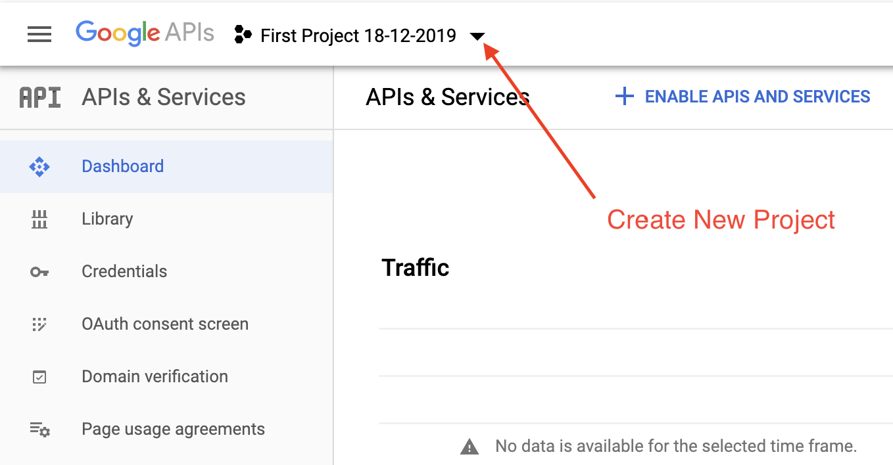

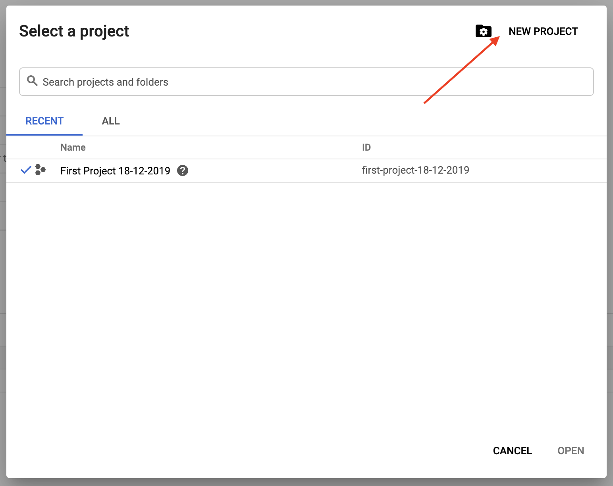

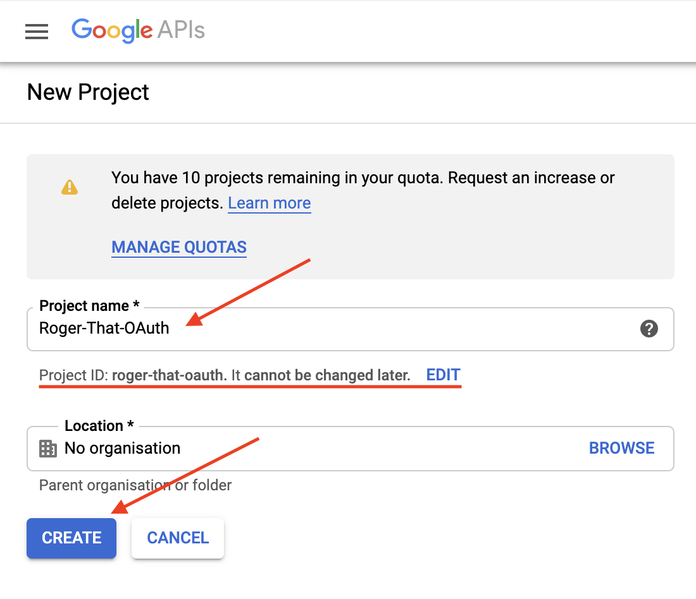

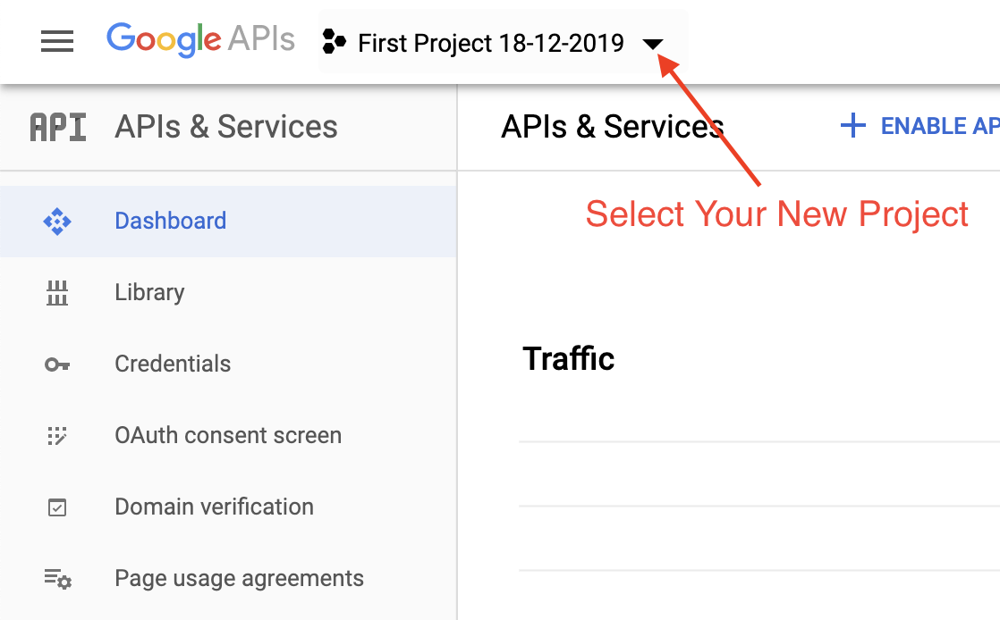


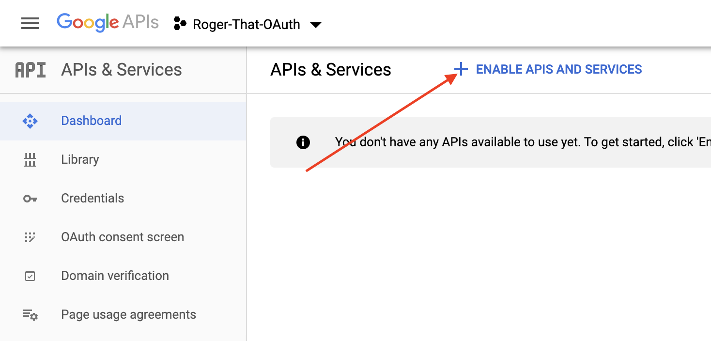

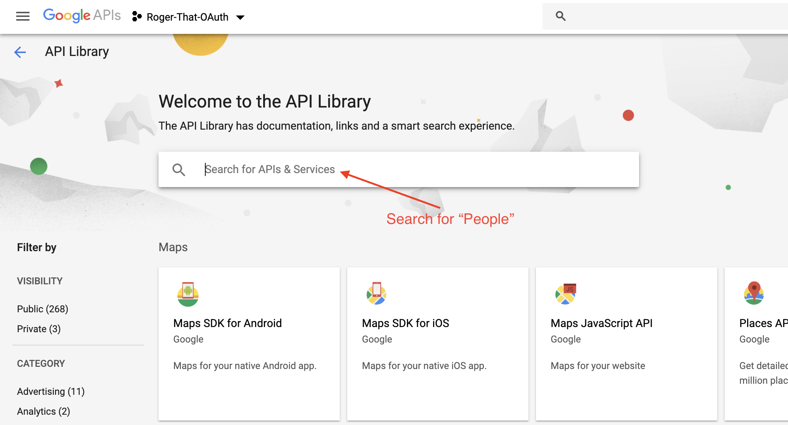

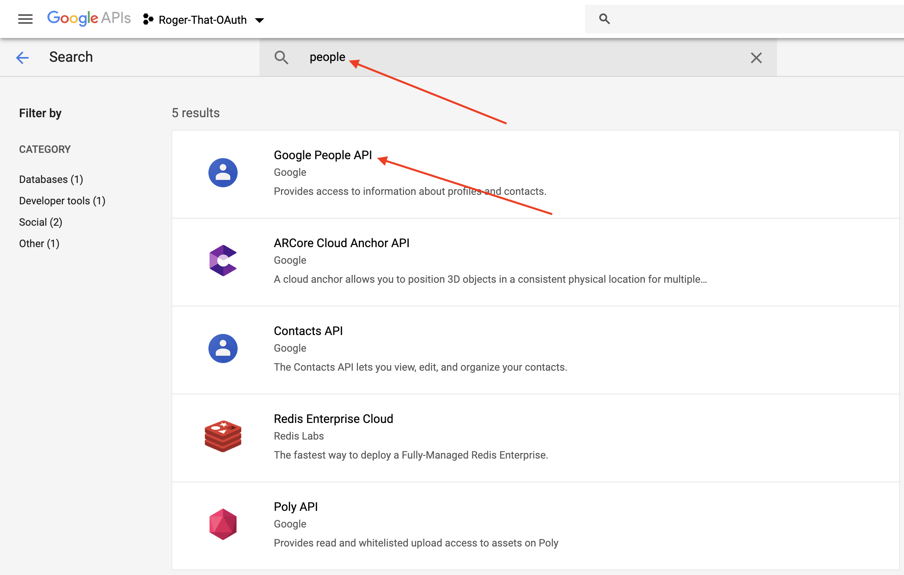

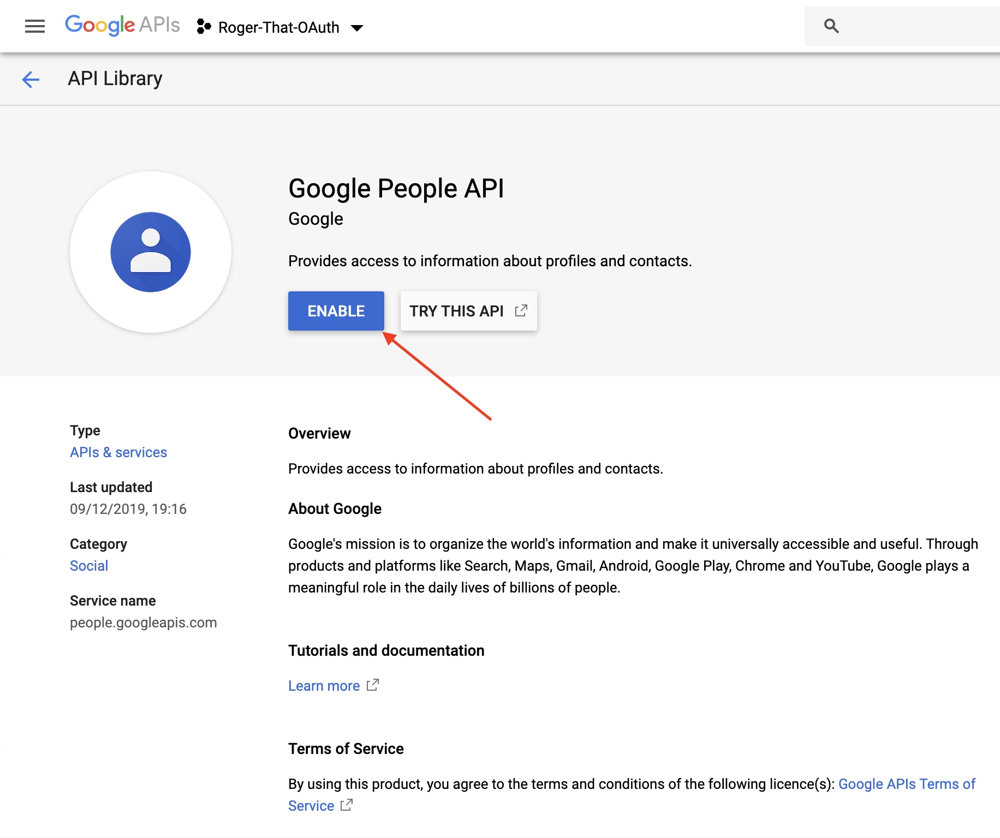


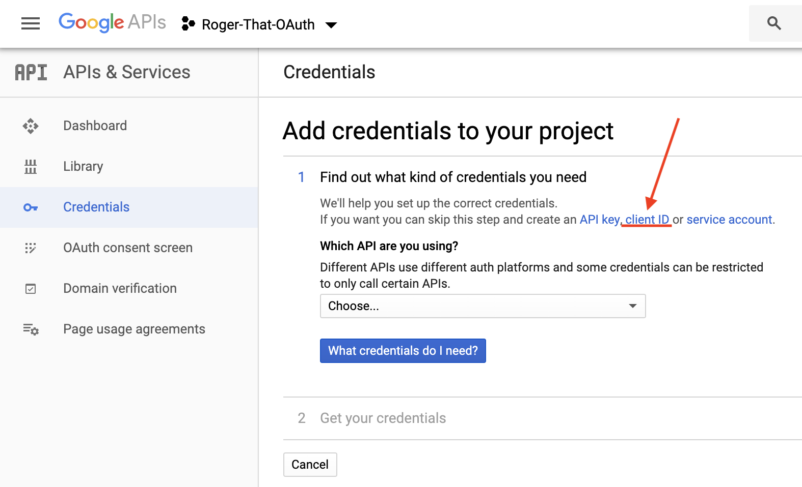

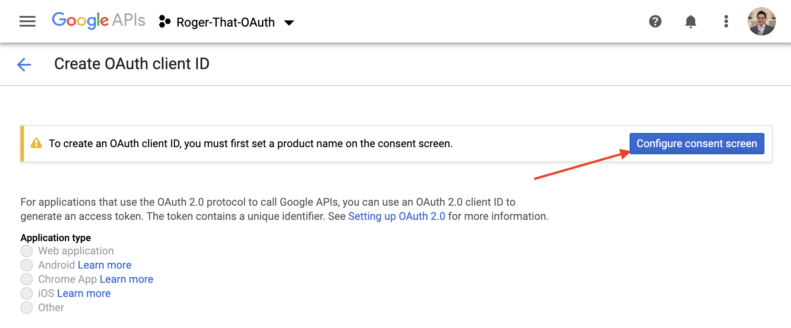


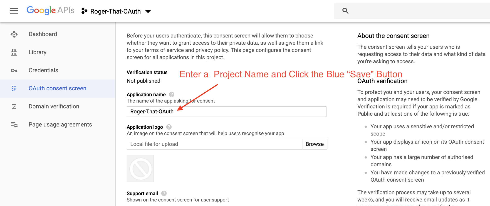

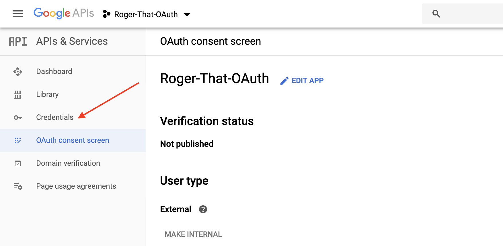

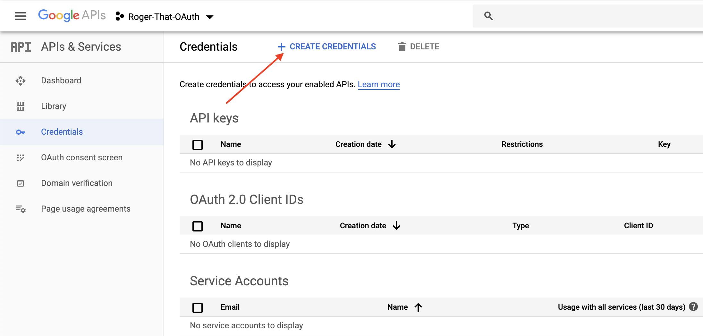

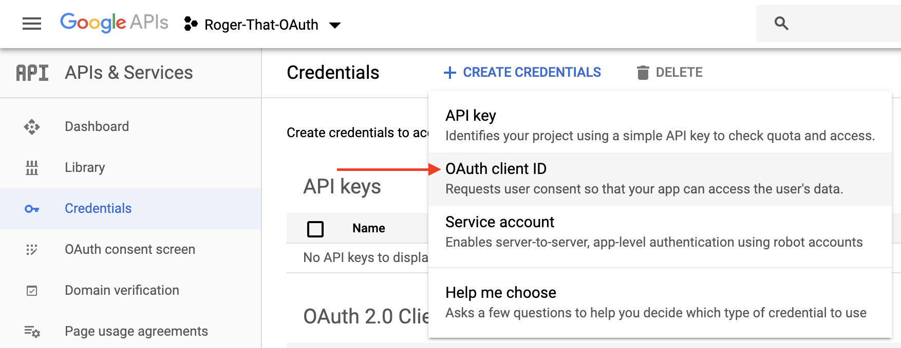

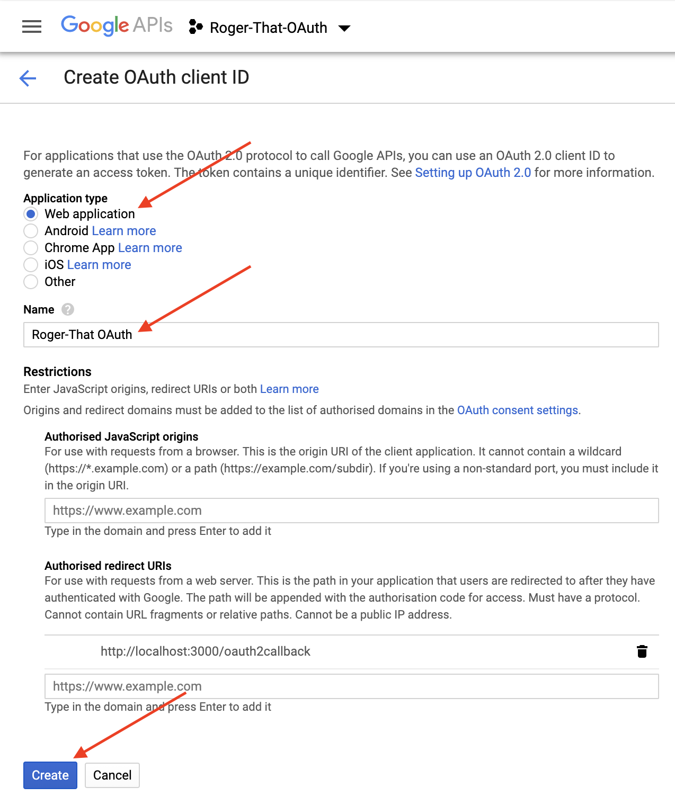

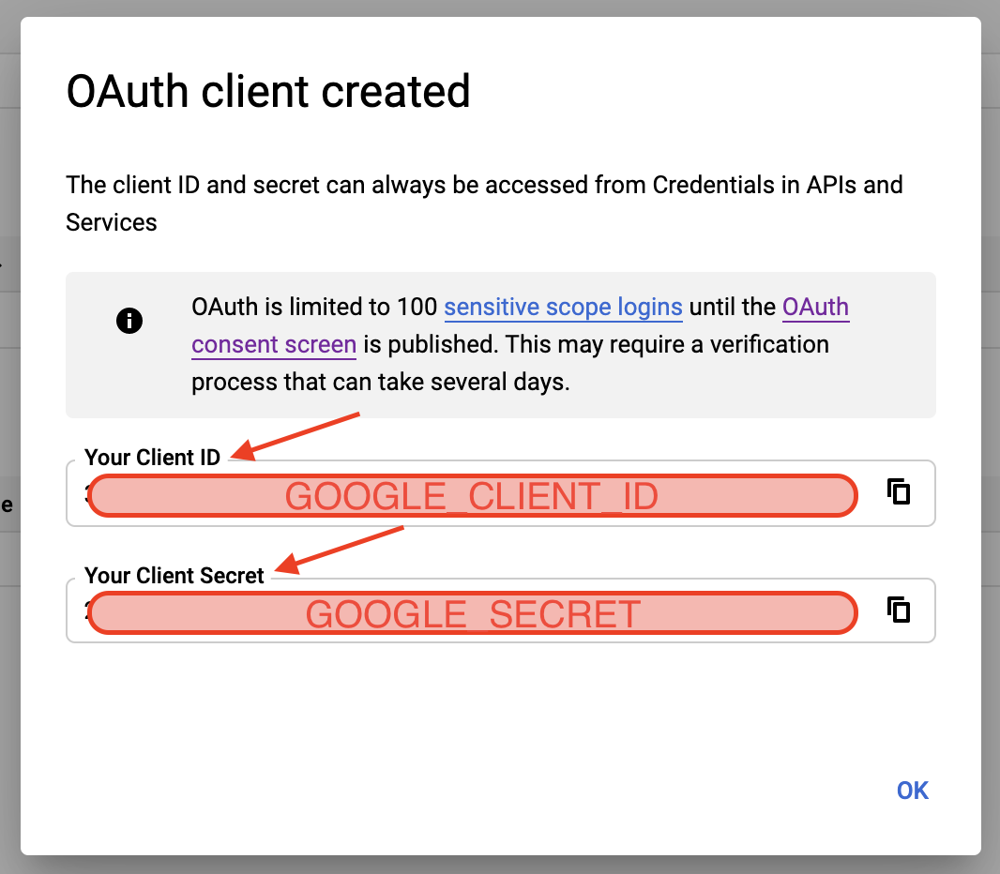

<h1 id="example">Example - Google OAuth</h1>

<h2 id="installation">Installation</h2>

[Go Back to Summary](#summary)

   ```bash
      npx express-generator -e
      npm i
      npm i mongoose
      npm i dotenv
      npm i express-session
      npm i passport
      npm i passport-google-oauth

      config/database.js
      config/passport.js

      controllers/students.js
      
      models/student.js

      routes/students.js

      views/students/index.ejs

      .env
   ```

<h2 id="env">.env</h2>

[Go Back to Summary](#summary)

   ```JavaScript
      DATABASE_URL=mongodb://localhost/studentsdb
      GOOGLE_CLIENT_ID="Paste Here Your Client ID"
      GOOGLE_CLIENT_SECRET="Paste Here Your Client Secret"
      GOOGLE_CALLBACK=http://localhost:3000/oauth2callback

      SESSION_SECRET=my$up3r$3cr3t
   ```

<h2 id="server">server.js</h2>

[Go Back to Summary](#summary)

* After `var cookieParser = require('cookie-parser');`

   ```JavaScript
      const session = require('express-session');              //! Require session package below cookie-parser
      const passport = require('passport');                    //! Require passport package -  AFTER session (alwyas)
   ```

* Before `var app = express();`

   ```JavaScript
      require('dotenv').config();                             //! Require Dotenv
      require('./config/database');                           //! Require MongoDB Database
      require('./config/passport');                           //! Require our passport file after database
   ```

* After `app.use(cookieParser());`
  
   ```JavaScript
      app.use(session({                                       //! Session middleware, mount AFTER cookieParser();
      secret: process.env.SESSION_SECRET,
      resave: false,
      saveUninitialized: true,
      }));
      app.use(passport.initialize());                         //! Passport middleware, mount AFTER session (always)
      app.use(passport.session());                            //! Passport middleware, mount AFTER session (always)
   ```

<h2 id="config-database">config/database.js</h2>

[Go Back to Summary](#summary)

   ```JavaScript
      const mongoose = require('mongoose');

      mongoose.connect(process.env.DATABASE_URL, {
         useNewUrlParser: true, 
         useUnifiedTopology: true 
      });

      mongoose.connection.on('connected', function () {
         console.log(`Mongoose connected to: ${process.env.DATABASE_URL}`);
      });

      module.exports = mongoose;
   ```

<h2 id="config-passport">config/passport.js</h2>

[Go Back to Summary](#summary)

   ```JavaScript
      const passport = require('passport');                                         //! Require passport package
      const GoogleStrategy = require('passport-google-oauth').OAuth2Strategy;       //! Require google strategy after passport
      const Student = require('../models/student');                                 //! Require database schema

      passport.use(new GoogleStrategy(
         {
            clientID: process.env.GOOGLE_CLIENT_ID,
            clientSecret: process.env.GOOGLE_CLIENT_SECRET,
            callbackURL: process.env.GOOGLE_CALLBACK
         },
         function(accessToken, refreshToken, profile, cb) {
            Student.findOne({ 'googleId': profile.id }, function(err, student) {
               if (err) return cb(err);
               if (student) {
                  return cb(null, student);
               } else {                                              //+ we have a new student via OAuth!
                  let newStudent = new Student({
                     name: profile.displayName,
                     email: profile.emails[0].value,
                     googleId: profile.id
                  });
                  newStudent.save(function(err) {
                     if (err) return cb(err);
                     return cb(null, newStudent);
                  });
               }
            });
         }
      ));

      passport.serializeUser(function(student, done) {               //+ Get the id
         done(null, student.id);
      });

      passport.deserializeUser(function(id, done) {                  //+ Use the id to find a user in our database
         Student.findById(id, function(err, student) {
            done(err, student);
         });
      });
   ```

<h2 id="controllers">controllers/students.js</h2>

[Go Back to Summary](#summary)

   ```JavaScript
      const Student = require('../models/student');         //! Require Models Schema

      function index(req, res, next) {
         console.log(req.query); //! requesting from the query(link) not from the body
         //+ Make the query object to use with Student.find based up
         //+ the user has submitted the search form or now
            let modelQuery = req.query.name ? {name: new RegExp(req.query.name, 'i')} : {};
         //+ Default to sorting by name
            let sortKey = req.query.sort || 'name';
            Student.find(modelQuery).sort(sortKey).exec(function(err, students) {
               if (err) return next(err);
               // Passing search values, name & sortKey, for use in the EJS
               res.render('students/index', { 
               students,
               user: req.user,
               name: req.query.name, 
               sortKey 
               });
            });
      };

      function addFact(req, res, next) {
         req.user.facts.push(req.body);
         req.user.save(function(err) {
            res.redirect('/students');
         });
      }

      module.exports = {
         index,
         addFact
      };
   ```

<h2 id="models">models/student.js</h2>

[Go Back to Summary](#summary)

   ```JavaScript
      const mongoose = require('mongoose');
      const Schema = mongoose.Schema;

      const factSchema = new Schema(
         {
            text: String
         }, 
         {
            timestamps: true
         }
      );

      const studentSchema = new Schema({
         name: String,
         email: String,
         cohort: String,
         avatar: String,
         facts: [factSchema],
         googleId: String
      }, {
         timestamps: true
      });

      module.exports = mongoose.model('Student', studentSchema);
   ```

<h2 id="routes-index">routes/index.js</h2>

[Go Back to Summary](#summary)

   ```JavaScript
      const express = require('express');
      const router = express.Router();
      const passport = require('passport');                          //! Require passport package

      router.get('/', function(req, res) {                           //! Render our only view
         res.redirect('/students');
      });

      router.get('/auth/google', passport.authenticate(
         'google',
         { 
            scope: ['profile', 'email'] 
         }
      ));

      router.get('/oauth2callback', passport.authenticate(
         'google',
         {
            successRedirect : '/students',
            failureRedirect : '/students'
         }
      ));

      router.get('/logout', function(req, res){
         req.logout();
         res.redirect('/students');
      });

      module.exports = router;
   ```

<h2 id="routes-students">routes/students.js</h2>

[Go Back to Summary](#summary)

   ```JavaScript
      const express = require('express');
      const router = express.Router();
      const studentsCtrl = require('../controllers/students');

      router.get('/students', studentsCtrl.index);
      router.post('/facts', isLoggedIn, studentsCtrl.addFact);
         //! Take note of the inserted `isLoggedIn` middleware function.
         //+ Our custom `isLoggedIn` middleware function, like all middleware, will either call `next()`, or `respond` to the request.
         //+ Put our new middleware at the very bottom
            function isLoggedIn(req, res, next) {
               if (req.isAuthenticated()) return next();
               res.redirect('/auth/google');
            }

      module.exports = router;
   ```

<h2 id="views-students-index">views/students/index.ejs</h2>

[Go Back to Summary](#summary)

   ```html
      <!DOCTYPE html>
      <html>
         <head>
            <title>SEI Student Fun Facts</title>
            <!-- Google Icon Fonts used by Materialize -->
            <link href="https://fonts.googleapis.com/icon?family=Material+Icons" rel="stylesheet">
            <!-- Materialize CSS Framework -->
            <link rel="stylesheet" href="https://cdnjs.cloudflare.com/ajax/libs/materialize/1.0.0/css/materialize.min.css">
            <link rel="stylesheet" href="stylesheets/style.css" />
            <!-- JavaScript for Materialize -->
            <script defer src="https://cdnjs.cloudflare.com/ajax/libs/materialize/1.0.0/js/materialize.min.js"></script>
         </head>
         <body>
            <div class="navbar-fixed">
               <nav>
                  <div class="nav-wrapper">
                  <a href="" class="brand-logo left">SEI Student Fun Facts</a>
                  <ul class="right">
                     <li>
                     <% if (user) { %>
                        <a href="/logout"><i class="material-icons left">trending_flat</i>Log Out</a>
                     <% } else { %>
                        <a href="/auth/google"><i class="material-icons left">vpn_key</i>Login with Google</a>
                     <% } %>
                     </li>
                  </ul>
                  </div>
               </nav>
            </div>
            <div class="container">
               <div id="search-row" class="row">
                  <h2 class="col s4 blue-grey-text text-darken-2">Students</h2>
                  <form action="/students" method="GET">
                  <div class="col s3 offset-s3">
                     <!-- search -->
                     <div class="input-field">
                        <input id="search" type="search" name="name" placeholder="search name" value="<%= name %>" autocomplete="off">
                        <i class="material-icons">close</i>
                     </div>
                  </div>
                  <div class="col s2">
                     <p>
                        <label for="sort-cohort">
                        <input name="sort" type="radio" id="sort-cohort" value="cohort" class="with-gap"
                           <%= sortKey === 'cohort' ? 'checked' : '' %> >
                        <span>Sort by Cohort</span>
                        </label>
                     </p>
                     <p>
                        <label for="sort-name">
                        <input name="sort" type="radio" id="sort-name" value="name" class="with-gap"
                           <%= sortKey === 'name' ? 'checked' : '' %> >
                        <span>Sort by Name</span>
                        </label>
                     </p>
                  </div>
                  </form>
               </div>
               <div class="row">
                  <div id="students" class="col s12">
                  <% students.forEach(function(student) { %>
                     <div class="card blue-grey">
                        <div class="card-content white-text">
                        <div>
                           <span class="card-title">
                              <i class="small material-icons">perm_identity</i>
                              <span class="student-name"><%= student.name %></span>
                              <% if (student.cohort) { %><span class="badge white">SEI <%= student.cohort %></span><% } %>
                           </span>
                        </div>
                        <ul class="collection">
                           <% student.facts.forEach(function(fact) { %>
                              <li class="collection-item blue-grey-text text-darken-2"><%- fact.text %></li>
                           <% }) %>
                        </ul>
                        <% if (student._id.equals(user && user._id)) { %>
                           <div class="card-action">
                              <form action="/facts" method="POST">
                              <input type="text" name="text" class="white-text">
                              <button type="submit" class="btn white-text">Add Fact</button>
                              </form>
                           </div>
                        <% } %>
                        </div>
                     </div>
                  <% }) %>
                  </div>
               </div>
            </div>
         </body>
      </html>
   ```