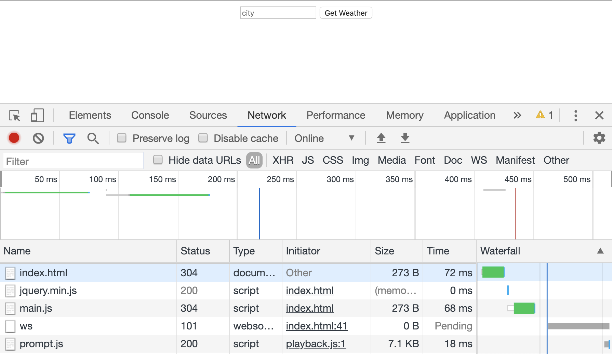
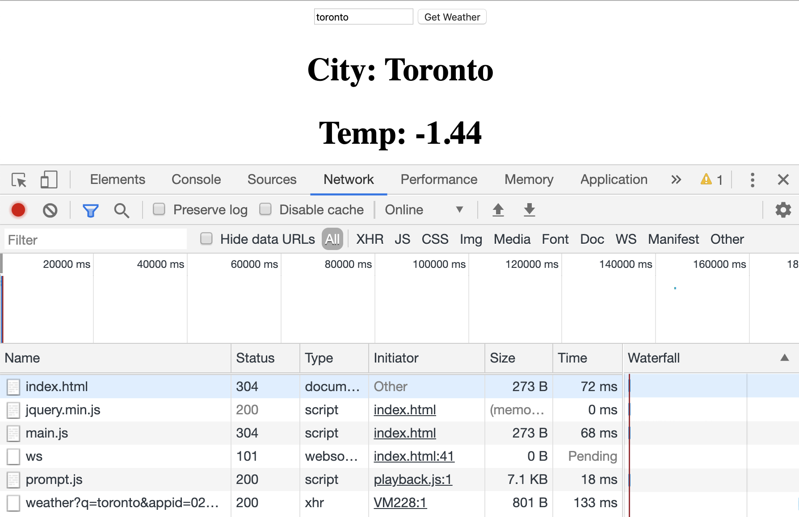
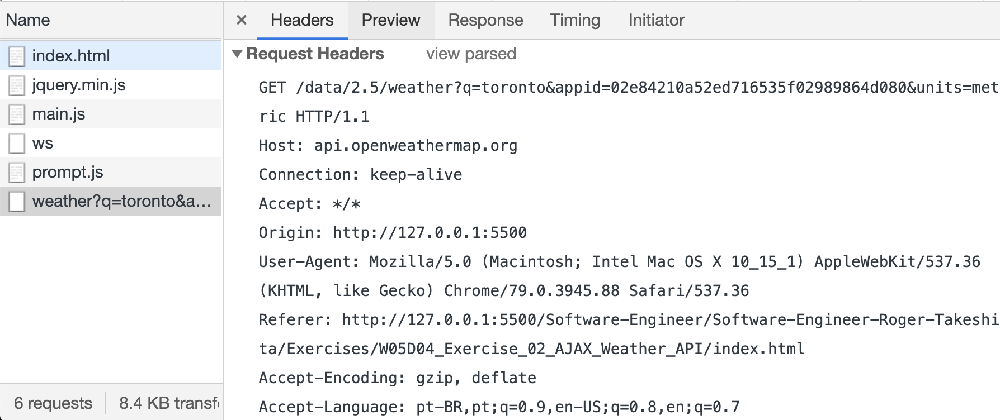
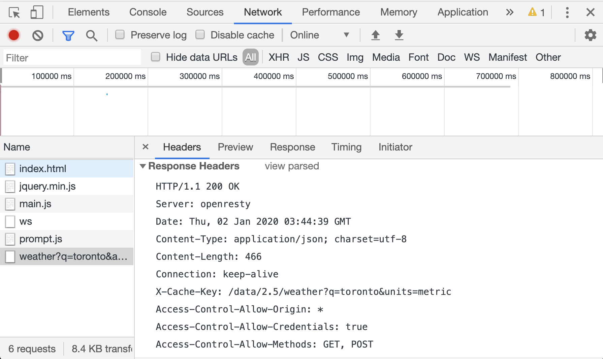
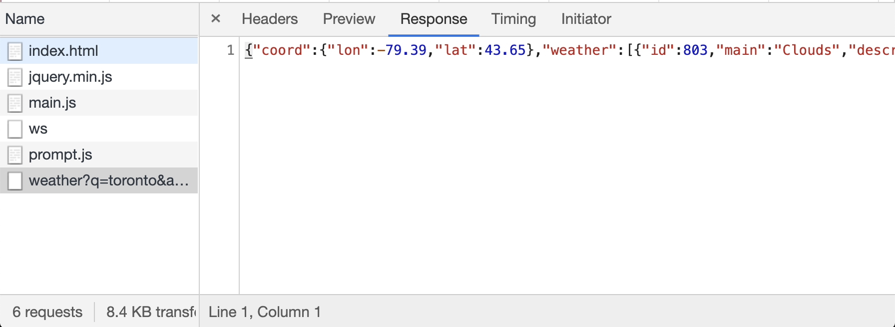

<h1 id="summary">Summary</h1>

* [AJAX](#ajax)
  * [What is AJAX?](#what-ajax)
  * [How Does AJAX Work?](#how-ajax)
  * [Making AJAX Requests](#making)
* [URLs](#url)
* [Example 1 - AJAX Making a Call to Google Books API](#example-1)
* [Example 2 - AJAX Making a Call to OpenWeatherMap](#example-2)
* [HTTP and Chrome's Network Tab](#http)
  * [What is HTTP?](#what)
  * [The Network Tab](#network)
* [Additional Resources](#resources)
* [Example 3 - AJAX Making a Call to Giphy API](#example-3)

<h1 id="ajax">AJAX</h1>

<h2 id="what-ajax">What is AJAX?</h2>

[Go Back to Summary](#summary)

* **AJAX** stands for **A**synchronous **Ja**vaScript and **X**ML
* **Asynchronous** is a term used to describe a non-blocking process. This means that, when we're making updates, we can load data into part of a page without having the whole page refresh.
* AJAX is used all over the web
* For example:
  * Think of a live search that loads results as you type. With AJAX, the whole page doesn't refresh every time you type a character - only the results are updated.
  * Or if you type a username into a web form, you may see a notification that the username has already been taken.

<h2 id="how-ajax">How Does AJAX Work?</h2>

[Go Back to Summary](#summary)

1. First, the browser requests data from a server
2. The server then responds with data, often in HTML or JSON format.
3. When the server has finished responding, the browser will fire an event. This event triggers a function that process the data and adds it to the page.
   
* This allows us to change the parts of the page that need to be updated - without affecting the entire page.

* **Advantages**

  * **Faster** - This is the most obvious reason for using AJAX on your front-end: AJAX allows easier and quicker interaction between user and website, as pages need not reload for new content to be displayed. The server doesn't have to get data, render HTML, and then spit it out; it just has to get data, and your already-loaded front-end does the rest.
  * **Compact** - With AJAX, several application features can be handled using a single web page. That means we modularize our app into smaller bits, and it becomes easier to work on.
  * **Backend Separated from Front-end** - Applications that use AJAX-heavy front-ends mean developers don't have to work on both sides of the stack at the same time. Some developers can be dedicated to building an API that just serves data, and others can focus on consuming that data and building interfaces.

* **Disadvantages**

  * **Back and Refresh Buttons are Rendered Useless** - Since things are loaded dynamically on a page without that page reloading (or more importantly, a URL being changed), clicking the back or refresh buttons won't work the way you're used to. That's actually a pretty big deal: UX designers are very familiar with the fact that users are accustomed to being able to hit back when they need to. Some advanced front-end frameworks have tried to solve this issue with clever workarounds, but that's not always the case and not always accurate.
  * **JavaScript Can be Disabled** - While JavaScript is secure and has been heavily used by websites for a long period of time, a percentage of website surfers prefer to turn JavaScript functionality off in their browser, rendering the AJAX application totally useless. That's not always the best thing to design for, and more often than not, you'll find yourself assuming users have JS on; but it's nonetheless important to know your whole site could be useless in some situations.
  * **You Have to Consider the UX Even More** - While UX is crucial for any application, the fact that a page doesn't refresh means you have to be even more considerate of what a user is experiencing. If something in your JavaScript goes wrong, your AJAX breaks, and you don't have failsafes thoughtfully built in, your user might be clicking a button and seeing absolutely nothing happen. Most regular users won't have their consoles open in order to notice any errors.

<h2 id="making">Making AJAX Requests</h2>

[Go Back to Summary](#summary)

* Let's dig into the `ajax()` method, which we can use to request and send data. This method provide us with granular control by giving us more than 30 settings for maneging our request.
* The syntax for AJAX method:

   ```JavaScript
      $.ajax({});
   ```

* Then we'll use object literal notation to pass in a settings object as the argument.
* Here are some of the settings we can provide:
   * type
   * url
   * data
   * sucess
   * error
   * beforeSend
   * complete
* We can provide them in any order, as long as we are using valid object literal notation.

  * **method**, this will take the value `GET` if we want to request data from a server, and `POST` if we want to send data that updates on a server.

   ```JavaScript
         $.ajax({
            method: 'GET'
         })
   ```

   * **url**, the URL setting defines the page where we'll send the request

   ```JavaScript
         $.ajax({
            method: 'GET',
            url: "http://api.openweathermap.org/data/2.5/weather?q="
         });
   ```

   * **data**, we have the data settings, which allows you to send additional data to the server along with the request.

   ```JavaScript
         $.ajax({
            method: 'GET',
            url: "http://api.openweathermap.org/data/2.5/weather?q=",
            data: {
               id: 123
            }
         });
   ```

   * **success**, we have the success setting, which runs if the request is successfully completed.

   ```JavaScript
         $.ajax({
            method: 'GET',
            url: "http://api.openweathermap.org/data/2.5/weather?q=",
            data: {
               id: 123
            },
            success: function(response) {
               $('#temp').html("The temperature in Detroit is " + response.temp);
            }
         });
   ```

   * **error**, the error setting will run a function if there is an error with the request.

   ```JavaScript
         $.ajax({
            method: 'GET',
            url: "http://api.openweathermap.org/data/2.5/weather?q=",
            data: {
               id: 123
            },
            success: function(response) {
               $('#temp').html("The temperature in Detroit is " + response.temp);
            },
            error: function() {
               alert("There was an error getting weather data.");
            }
         });
   ```

   * **beforeSend**, we can use the beforeSend setting to run code before the request is sent.

   ```JavaScript
         $.ajax({
            method: 'GET',
            url: 'http://api.openweathermap.org/data/2.5/weather?q=',
            data: {
            id: 123
            },
            success: function(response) {
               $('#temp').html('The temperature in Detroit is ' + response.temp);
            },
            error: function() {
               alert('There was an error getting weather data.');
            },
            beforeSend: function () {
               $('#page').append('Loading');
            }
         });
   ```

   * **complete**, and finally, we can use the complete setting to run a function after the request is complete.

   ```JavaScript
         $.ajax({
            method: 'GET',
            url: 'http://api.openweathermap.org/data/2.5/weather?q=',
            data: {
            id: 123
            },
            success: function(response) {
               $('#temp').html('The temperature in Detroit is ' + response.temp);
            },
            error: function() {
               alert('There was an error getting weather data.');
            },
            beforeSend: function () {
               $('#page').append('Loading');
            },
            complete: function () {
               $('#loading').remove();
            }
         });
   ```

<h1 id="url">URLs</h1>

[Go Back to Summary](#summary)

* We'll need a URL where we can find the JSON data for a book that matches an ISBN number.
* How does the server know where the request is actually asking? This is the job of the URL, a special path that specifies where a resource can be found on the web.
* Let's take a look at the differente components of a URL that could be used for API call

`https://www.googleapis.com/books/v1/volumes?q=isbn:0679775439`

   * `https:`, protocol
   * `www.googleapis.com`, host/domain
   * `books/v1/volumes/?`, resource path
   * `q=isbn:0679775439`, query

* JSON response

   ```json
      {
         "kind": "books#volumes",
         "totalItems": 1,
         "items": [
            {
               "kind": "books#volume",
               "id": "iTt3WN2U8wwC",
               "etag": "74Uf1dmsAfQ",
               "selfLink": "https://www.googleapis.com/books/v1/volumes/iTt3WN2U8wwC",
               "volumeInfo": {
                  "title": "The Wind-up Bird Chronicle",
                  "authors": [
                     "Haruki Murakami"
                  ],
                  "publisher": "Vintage",
                  "publishedDate": "1998",
                  "description": "Superimposes the collapse of a marriage over the investigation into recovered war memories and a man's search for his own identity",
                  "industryIdentifiers": [
                     {
                        "type": "ISBN_13",
                        "identifier": "9780679775430"
                     },
                     {
                        "type": "ISBN_10",
                        "identifier": "0679775439"
                     }
                  ],
                  "readingModes": {
                     "text": false,
                     "image": false
                  },
                  "pageCount": 607,
                  "printType": "BOOK",
                  "categories": [
                     "Fiction"
                  ],
                  "averageRating": 4,
                  "ratingsCount": 155,
                  "maturityRating": "NOT_MATURE",
                  "allowAnonLogging": false,
                  "contentVersion": "0.2.0.0.preview.0",
                  "panelizationSummary": {
                     "containsEpubBubbles": false,
                     "containsImageBubbles": false
                  },
                  "imageLinks": {
                     "smallThumbnail": "http://books.google.com/books/content?id=iTt3WN2U8wwC&printsec=frontcover&img=1&zoom=5&edge=curl&source=gbs_api",
                     "thumbnail": "http://books.google.com/books/content?id=iTt3WN2U8wwC&printsec=frontcover&img=1&zoom=1&edge=curl&source=gbs_api"
                  },
                  "language": "en",
                  "previewLink": "http://books.google.ca/books?id=iTt3WN2U8wwC&printsec=frontcover&dq=isbn:0679775439&hl=&cd=1&source=gbs_api",
                  "infoLink": "http://books.google.ca/books?id=iTt3WN2U8wwC&dq=isbn:0679775439&hl=&source=gbs_api",
                  "canonicalVolumeLink": "https://books.google.com/books/about/The_Wind_up_Bird_Chronicle.html?hl=&id=iTt3WN2U8wwC"
               },
               "saleInfo": {
                  "country": "CA",
                  "saleability": "NOT_FOR_SALE",
                  "isEbook": false
               },
               "accessInfo": {
                  "country": "CA",
                  "viewability": "PARTIAL",
                  "embeddable": true,
                  "publicDomain": false,
                  "textToSpeechPermission": "ALLOWED_FOR_ACCESSIBILITY",
                  "epub": {
                     "isAvailable": false
                  },
                  "pdf": {
                     "isAvailable": false
                  },
                  "webReaderLink": "http://play.google.com/books/reader?id=iTt3WN2U8wwC&hl=&printsec=frontcover&source=gbs_api",
                  "accessViewStatus": "SAMPLE",
                  "quoteSharingAllowed": false
               },
               "searchInfo": {
                  "textSnippet": "Superimposes the collapse of a marriage over the investigation into recovered war memories and a man&#39;s search for his own identity"
               }
            }
         ]  
      }
   ```

* Now that we've seen the full JSON response, let's take a look at a stripped down version of the response showing us the relevant data.
* You can see that we have an array named "items". This array contains a JSON object.

   ```json
      {
         "items": [
            {
               "volumeInfo": {
                  "title": "The Wind-up Bird Chronicle",
                  "description": "Superimposes the collapse of a marriage over the investigation into recovered war memories and a man's search for his own identity",
                  "imageLinks": {
                     "thumbnail": "http://books.google.com/books/content?id=iTt3WN2U8wwC&printsec=frontcover&img=1&zoom=1&edge=curl&source=gbs_api"
                  },
                  "previewLink": "http://books.google.com/books?id=iTt3WN2U8wwC&printsec=frontcover&dq=isbn:0679775439&hl=&cd=1&source=gbs_api"
               }
            }
         ]
      }
   ```

   * Within that object, there is an object named `volumeInfo` that contains information we want to access about the book: a title, description, thumbnail, and preview link.
   * To access the title in this array, we can use the following syntax:
  
   ```JavaScript
         response.item[0].volumeInfo.title
   ```

<h1 id="example-1">Example 1 - AJAX Making a Call to Google Books API</h1>

[Go Back to Summary](#summary)

* We'll create a basic site where users can add books to a reading list by entering their International Sandard Book Number (ISBN).
* Let's start with a simple HTML where a user can enter an ISBN, as well as an unordered list where we will add each book the user search for:

* In `index.html`, add the following code to the body
  
   ```html
      <h1>Search for a book by ISBN</h1>

      <form>
         <input type="text" id="isbn" name="isbn" value="" placeholder="Please enter an ISBN">
         <button type="submit">Find Book</button>
      </form>

      <ul class="books">
      </ul>

      <script src="https://ajax.googleapis.com/ajax/libs/jquery/3.3.1/jquery.min.js"></script>
      <script src="main.js" type="text/javascript" charset="utf-8" async defer></script>
   ```

* In `main.js`
  
   ```JavaScript
      const googleBooksUrl = "https://www.googleapis.com/books/v1/volumes?q=isbn:";

      $('form').on('submit', function(e) {
         e.preventDefault();
         const isbn = $('#isbn').val();

         $.ajax({
            method: 'GET',
            url: googleBooksUrl + isbn,
            success: function(response) {
               console.log(response);
               const bookInfo = response.items[0].volumeInfo;
               const listItemHTML = `<li>
                     <h2>${bookInfo.title}</h2>
                     <p>${bookInfo.description}</p>
                     
                     <a href= ${bookInfo.previewLink }>Preview Book</a>
                     </li>`
               $('.books').append(listItemHTML);
            }
         });
      });
   ```

   > Note how constructing an HTML fragment for our list item and adding in the data that needs to be displayed using JavaScript gets a bit messy. We can use a templating library, such as Handlebars, to make this process cleaner and keep HTML out of our JS files.

<h1 id="example-2">Example 2 - AJAX Making a Call to OpenWeatherMap</h1>

[Go Back to Summary](#summary)

[OpenWeatherMap API](https://openweathermap.org/api)

* API Keys

   * When we click on the "How to Start" link, we are taken to a page that provides us with information on how to get an [API Key](https://openweathermap.org/appid).
   * For security reasons, many APIs require the use of keys.
   * An API key is like a signature that unlikely identifies a user. This helps APIs keep track of their traffic and monitor any suspicious activity, such as an individual user sending too many requests.
   * For example, malicious users might try using multiple usernames until they find one that works. Key can help prevent these kinds of attacks by limiting how many requests one user can make.
   * OpenWeatherMap's documentation makes it easy for us to obtain an API key, we simply click the "Sign Up" button and create an account, and then you can get an API key;
   * To make an API call, we need to add our key to the URL:

   ```html
         http://api.openweathermap.org/data/2.5/forecast/city?id=524901&APPID={APIKEY}
   ```

   * Here's an example provided in the documentation

   ```html
         api.openweathermap.org/data/2.5/forecast/city?id=524901&APPID=1111111111
   ```

   * As you can see, all wee need to do is append our API key to the end of the URL

* In `index.html`, add the following code to the body
  
   ```html
      <form>
         <input type="text" name="city" value="" placeholder="city" id="city">
         <input type="submit" value="Get Weather" id="getTemp">
      </form>

      <ul class="temp"></ul>

      <script src="https://ajax.googleapis.com/ajax/libs/jquery/1.11.3/jquery.min.js"></script>
      <script src="js/main.js" type="text/javascript" charset="utf-8" async defer></script>
   ```

* In `main.js`
  
   ```JavaScript
      const weatherUrl = 'http://api.openweathermap.org/data/2.5/weather?q=';

      const key = 'openweathermap_key';

      $("form").on("submit", (e) => {
         e.preventDefault();

         const city = $("#city").val();

         $("button").attr("disabled", true);
         $(".temp").html("<if class='fa fa-spinner fa-spin'></i>")
         $.ajax({
            method: "GET",
            url: `${weatherUrl}${city}&appid=${key}&units=metric`,
            success: function(response) {
               console.log(response);
               const temp = response.main.temp;
               let listItemHTML = ` <h2>City: ${response.name}</h2>
                                    <h2>Temp: ${temp}</h2>`;
               $('.temp').append(listItemHTML);
            },
            error: function(response) {
               console.log(response);
            },
            complete: function() {
               $('button').attr('disabled', false);
            }
         });
      });
   ```

<h1 id="http">HTTP and Chrome's Network Tab</h1>

<h2 id="what">What is HTTP?</h2>

[Go Back to Summary](#summary)

* HTTP (**H**yper**T**ext **T**ransfer **P**rotocol) is a protocol (a system of rules) that determines how web pages ("HyperText") are sent ("Transfered") from one place to another.
* Among other things, it defines how messages passed between HTTP clients and HTTP servers should be formatted.
* The web is a service that works through a combination of clients (which make requests) and servers (which receive requests).

* Let's seee how clients and server handle the request-and-response process.
1. A client sends an HTTP request to a HTTP server running on a remote machine. The hostname, given in the URL, indicates which server will receive the request.
2. In the last lesson, we saw how the URL tells the server what the request is asking. Here's a refesher on the different elements that make up a URL:

`htttp://www.domain.com:1234/path/to/resource?a=b&x=y`

   * **http** protocol
   * **www.domain.com** host
   * **1234** port
   * **path/to/resource** resource path
   * **a=b&x=y** query

3. The HTTP server processes the HTTP request. This may entail passing the request to a web application written in a language such as Ruby, which creates an HTTP response.
4. The response is sent back to the client
5. The client processes the response

<h2 id="network">The Network Tab</h2>

[Go Back to Summary](#summary)

* Let's explore some HTTP resources by looking at HTTP requests and responses using Chrome Inspector.
* To view this request-and-response cycle in Chrome, we'll open up Inspector (Command+Option+i) and select the **Network** tab.
* In order to swee the requests and responses that are sent out when the page frist loads, we'll need to refresh teh page:



* As you can see, we have a few HTTP requests and responses in the **Network** tab.
* For each request, you'll see **Name**, **Method**, **Status**, **Type** and **Size**, along with information about how long it took to get each of these resources.
* Most of this information comes from the HTTP request and response.
* Some HTTP requests are for CSS, JavaScript, and images referenced by the HTML.
* Let's go ahead and search weather for a city
  * When we do this, we can see that the **Network** tab displays our API request:
  


  * In order to inspect this request and its reponse, we'll chick on **Headers** tab:


* Headers are metadata properties of an HTTP request or response, separate from the body of the message.
  



* **Request**
  * We can find all kind of information in the request header, which shows the request that was sent to the server:

   ```json
         GET /data/2.5/weather?q=toronto&appid=02e84210a52ed716535f02989864d080&units=metric HTTP/1.1
         Host: api.openweathermap.org
         Connection: keep-alive
         Accept: */*
         Origin: http://127.0.0.1:5500
         User-Agent: Mozilla/5.0 (Macintosh; Intel Mac OS X 10_15_1) AppleWebKit/537.36 (KHTML, like Gecko) Chrome/79.0.3945.88 Safari/537.36
         Referer: http://127.0.0.1:5500/Software-Engineer/Software-Engineer-Roger-Takeshita/Exercises/W05D04_Exercise_02_AJAX_Weather_API/index.html
         Accept-Encoding: gzip, deflate
         Accept-Language: pt-BR,pt;q=0.9,en-US;q=0.8,en;q=0.7
   ```
   
   * Here is the structure for the request:
   `[http request method] [URL] [http version] [list of headers]`

* **HTTP Request Methods**

  * The first word in the request line, `GET` is the HTTP request's method.
  * Here is a full list of the HTTP request methods available to use:
    * `GET`: Retrieve a resource.
    * `POST`: Create a resource.
    * `PATCH`: (or `PUT`, but `PATCH` is recommended): Upudate an existing resource.
    * `DELETE`: Delete a resource.
    * `HEAD`: Retrieve the headers for a resource.
  
   > What's the difference between `PUT` and `PATCH`? `PUT` should be reserved for replacing an existing resource while `PATCH` can be used for updating pieces of an existing resource.

* **Response**

  * When a client sends a request, the server sends back a response. Let's take a look at the response headers that were returned:

   ```json
         HTTP/1.1 200 OK
         Server: openresty
         Date: Thu, 02 Jan 2020 03:44:39 GMT
         Content-Type: application/json; charset=utf-8
         Content-Length: 466
         Connection: keep-alive
         X-Cache-Key: /data/2.5/weather?q=toronto&units=metric
         Access-Control-Allow-Origin: *
         Access-Control-Allow-Credentials: true
   ```
   * The standard format for this response is:
   `[http version] [status] [reason] [list of headers] [response body] # typically HTML, JSON, ...`
    * The HTTP version shoudl be 1.1
    * Status Codes have standard meanings, here are a few:
         | Code | Reason                |
         |------|-----------------------|
         | 200  | OK                    |
         | 301  | Moved Permanently     |
         | 302  | Moded Temporarily     |
         | 400  | Bad Request           |
         | 403  | Forbidden             |
         | 404  | Not Found             |
         | 500  | Internal Server Error |

* **Response Body**: if we click on the **Response** tab:
  * The response is a JSON object with the current weather data we requested from the OpenWeatherMap API.
  


```json
      {
         "coord":
            {
               "lon":-79.39,
               "lat":43.65
            },
         "weather":
            [{
               "id":803,
               "main":"Clouds",
               "description":
               "broken clouds",
               "icon":"04n"
            }],
         "base":"stations",
         "main":
            {
               "temp":-1.44,
               "feels_like":-6.97,
               "temp_min":-4.44,
               "temp_max":1.67,
               "pressure":1007,
               "humidity":74
            },
         "visibility":14484,
         "wind":
            {
               "speed":4.1,
               "deg":240
            },
         "clouds":
            {
               "all":75
            },
         "dt":1577936652,
         "sys":
            {
               "type":1,
               "id":941,
               "country":"CA",
               "sunrise":1577883062,
               "sunset":1577915431
            },
         "timezone":-18000,
         "id":6167865,
         "name":"Toronto",
         "cod":200
      }
```

<h1 id="resources">Additional Resources</h1>

[Go Back to Summary](#summary)

* [jQuery AJAX Documentation](http://api.jquery.com/jquery.ajax/)
* [Cross Domain Requests in JS](https://jvaneyck.wordpress.com/2014/01/07/cross-domain-requests-in-javascript/)
* [What is Cross Origin Resource Sharing (CORS)?](https://www.maxcdn.com/one/visual-glossary/cors/)

<h1 id="example-3">Example 3 - AJAX Making a Call to Giphy API</h1>

[Go Back to Summary](#summary)

* [Giphy API](https://developers.giphy.com/docs/api/endpoint#search)

* In `main.js`:

   ```JavaScript
      const giphyURL = 'http://api.giphy.com/v1/gifs/search?q=';
      const apiKey = '&api_key=dc6zaTOxFJmzC';
      let offsetCount = 0;

      $('form').on('submit', function(e) {
      e.preventDefault();

      const input = $('#search-input').val();

      $.ajax({
         method: 'GET',
         url: `${giphyURL}${input}${apiKey}`,
         success: function(response) {
            console.log(response);
            $('#giphs').empty();

            let gifs = '';

            response.data.forEach((gif) => {
            gifs += `</img>`
            })

            $('#giphs').append(gifs);
            $('button').attr('disabled', false);
         },
         error: function(response) {
            console.log(response);
         }
      })
      });

      $(window).scroll(function () {
      if ($(document).height() - $(this).height() == $(this).scrollTop()) {
         const input = $('#search-input').val();

         $.ajax({
            method: 'GET',
            url: `${giphyURL}${input}${apiKey}&offset=${offsetCount}`,
            success: function(response) {
            console.log(response);
      
            let gifs = '';
      
            response.data.forEach((gif) => {
               gifs += `</img>`
            })
      
            $('#giphs').append(gifs);
            offsetCount += 25
            },
            error: function(response) {
            console.log(response);
            }
         })
      }
      });
   ```

* In `index.html`

   ```html
      <!DOCTYPE html>
      <html lang="en">
      <head>
         <meta charset="UTF-8">
         <meta name="viewport" content="width=device-width, initial-scale=1.0">
         <meta http-equiv="X-UA-Compatible" content="ie=edge">
         <script src="https://code.jquery.com/jquery-3.4.1.min.js" integrity="sha256-CSXorXvZcTkaix6Yvo6HppcZGetbYMGWSFlBw8HfCJo=" crossorigin="anonymous"></script>
         <script defer src='js/main.js'></script>
         <title>GIPHY</title>
      </head>
      <body>
         <h1>Giffaw</h1>
         <form>
            <input type='text' name='search' id='search-input' value="puppies">
            <input type='submit'>
         </form>
         <div id='giphs'>
         </div>
      </body>
      </html>
   ```